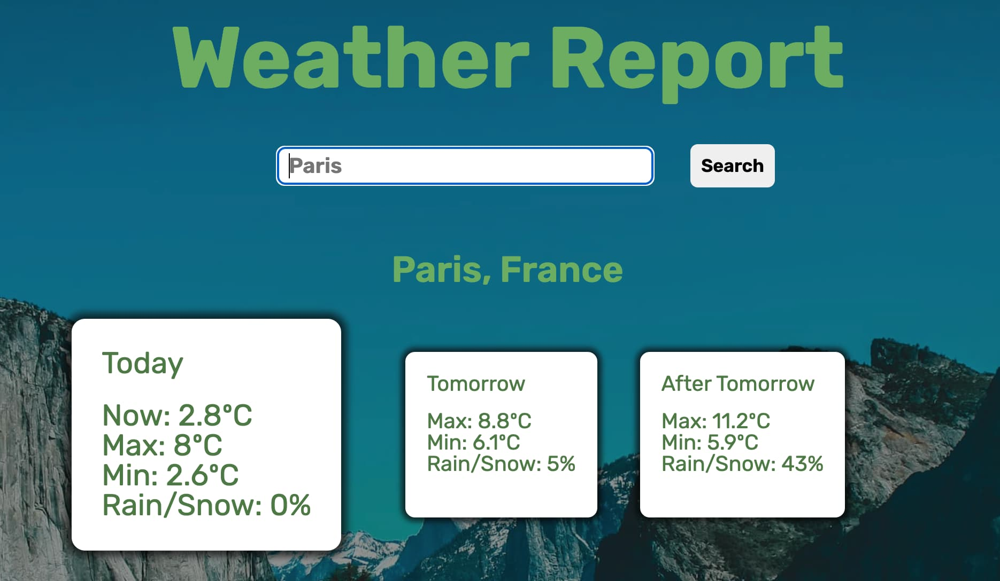

# Weather App

A website to search for the weather in a city.

## About the Project

### Preview

    

### Live

<a href='http://google.com/'>Google</a>

### Objective

The goal of the project is to learn API calls through the usage of async/await and promises.

### Assignment

[The Odin Project (Dec '24)](https://www.theodinproject.com/lessons/javascript-webpack)

### Notable Features

- Search for a city
- Display current weather
- Display upcoming weather

### Built With

## Development

### To Do

- [x] Rewrite the README
  - [x] Title
  - [x] Objective
  - [x] Project Statement
  - [x] Notable Features
- [ ] Plan
  - [x] User stories
  - [x] Features
  - [x] Flowchart
  - [x] Architecture
  - [x] UI Design/Sketch
- [ ] Development
  - [x] Basic HTML
    - [x] Title
    - [x] Meta
    - [x] Rough Structure
    - [x] Favicons
  - [ ] Webpack
    - [ ] "npm init"
    - [ ] "npm install --save-dev webpack webpack-cli"
    - [ ] "npm install --save-dev html-webpack-plugin"
    - [ ] Remove script tag
    - [ ] "npm install --save-dev style-loader css-loader"
    - [ ] Import the CSS file into a JS file
    - [ ] "npm install --save-dev html-loader"
    - [ ] Follow the steps in "img.js"
    - [ ] "npm install --save-dev webpack-dev-server"
    - [ ] "npx webpack serve"
    - [ ] Kill the server with ^C
  - [ ] Console-Based Logic
  - [ ] Fix bugs
    - [ ] No Bugs Yet!
  - [ ] UI
    - [ ] Refined UI
    - [ ] Color Palette
    - [ ] Overall Layout
    - [ ] Individual Section Layout
    - [ ] Menu/Nav
  - [ ] Responsive Design
    - [ ] Resposive Images (Art Direction)
    - [ ] Media Queries
    - [ ] Mobile Menu
  - [ ] Check Accessibility
  - [ ] Optimization
    - [ ] Images
    - [ ] Lighthouse
- [ ] Deployment
  - [ ] Change "development" to "production" in webpack.config.js (undo if need)
  - [ ] "git branch gh-pages" (one time only)
  - [ ] Commit everything (redo each time)
  - [ ] "git checkout gh-pages && git merge main --no-edit" (redo each time)
  - [ ] "npx webpack" (redo)
  - [ ] 'git add dist -f && git commit -m "Deployment commit"' (redo)
  - [ ] "git subtree push --prefix dist origin gh-pages" (redo)
  - [ ] "git checkout main" (redo)
- [ ] Review README
  - [ ] Live Page Link
  - [ ] Built With
  - [ ] Reflection

### User Stories

- As a user, I want to know the weather forecast for my location (by default)
- As a user, I want to search for a city at any time
- As a user, I want to know the weather of a city
- As a user, I want to see a loading event when waiting for the information

### Features

Search bar
Loading wheel
Current weather
Five-day forecast

### Flowchart

Page Loads -> Request user location -> Fetch weather information
-> Display loading wheel -> Display information

User Searches -> Fetch -> Display loading wheel -> Display information

### Architecture

model.js
export const state = {
-location
-weather info
}

controller.js
getLocation()
addHandlers()

view.js
render(state)
addHandlerSpinner(handler)
addHandlerReceiveInput(handler)
export default new View();

## Reflection

### Lessons & Difficulties

Some lessons learned along the way

### Diary

The goal of the project is to practice API calls and promises. I will use async/await because it seems cleaner than other options. The website will not be super stylish, but it will not be pure HTML either.
