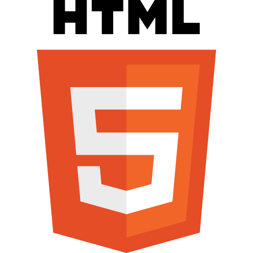

# Simple Template

A template for projects that may require Parcel

## About the Project

### Preview

    

### Live

<a href='http://google.com/'>Google</a>

### Objective

The goal of the project is to learn xyz by building abc.

### Notable Features

- Add something
- Edit something
- Remove something
- Allow users to complicate dev's job

### Built With

<!--  -->
<!--  -->

## Development

### To Do

- [ ] Rewrite the README
  - [ ] Title
  - [ ] Live Page Link
  - [ ] Objective
  - [ ] Project Statement
  - [ ] Notable Features
- [ ] Plan
  - [ ] User stories
  - [ ] Features
  - [ ] Flowchart
  - [ ] Architecture
  - [ ] UI Design/Sketch
- [ ] Development
  - [ ] Basic HTML
    - [ ] Title
    - [ ] Meta
    - [ ] Rough Structure
    - [ ] Favicons
  - [ ] Parcel
    - [ ] "npm init"
    - [ ] Remove "main": "index.js"
    - [ ] Later Replace With "default": "index.html"
    - [ ] Rewrite "test" to "start": "parcel index.html"
    - [ ] Add "build": "parcel build index.html --dist-dir ./dist"
    - [ ] "npm i parcel -D"
    - [ ] Run Local Host With CLI: "npm start"
    - [ ] Build Deployment-Ready Files With CLI: "npm run build"
  - [ ] Console-Based Logic
  - [ ] Fix bugs
    - [ ] No Bugs Yet!
  - [ ] UI
    - [ ] Refined UI
    - [ ] Color Palette
    - [ ] Overall Layout
    - [ ] Individual Section Layout
    - [ ] Menu/Nav
  - [ ] Responsive Design
    - [ ] Resposive Images (Art Direction)
    - [ ] Media Queries
    - [ ] Mobile Menu
  - [ ] Check Accessibility
  - [ ] Optimization
    - [ ] Images
    - [ ] Lighthouse
- [ ] Review README

### User Stories

- As a user, I want...

### Features

- Users can...

### Flowchart

Page Loads ->

### Architecture

class App {
-greet()
}

## Reflection

### Lessons & Difficulties

Some lessons learned along the way

### Diary

Some thoughts regarding the project
